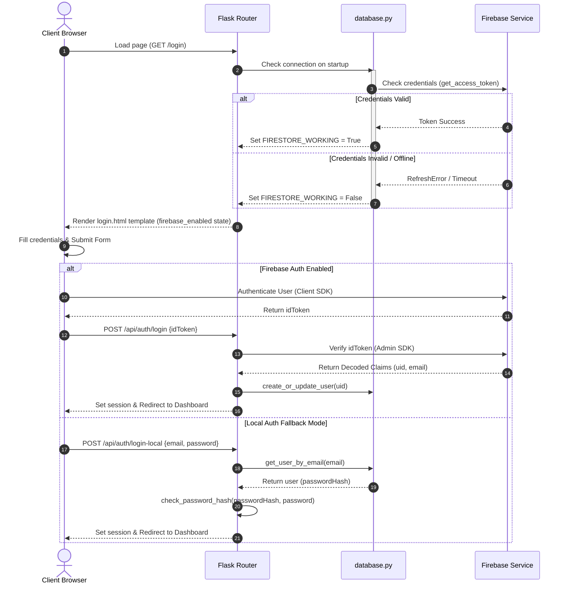
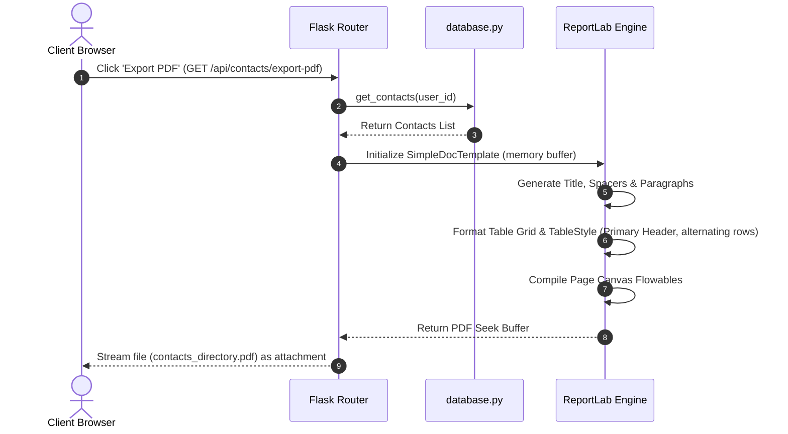
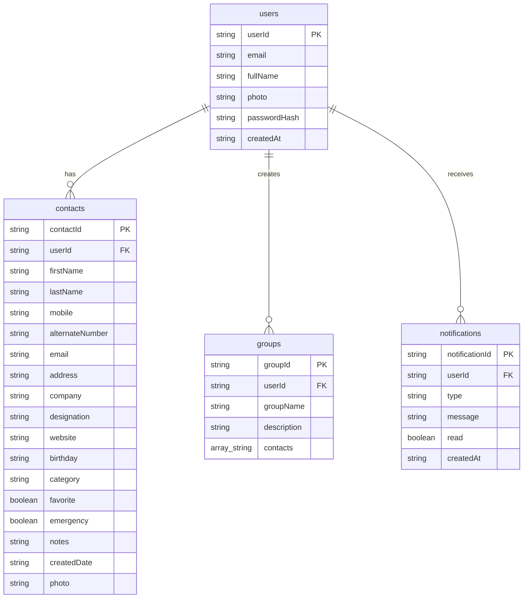

# 📇 ContactPro CRM - Enterprise Contact Management System

[](https://github.com/aravinth081/contact-management-system)
[](https://github.com/aravinth081/contact-management-system)
[](https://opensource.org/licenses/MIT)
[](https://www.python.org/)
[](https://flask.palletsprojects.com/)
[](https://firebase.google.com/)

An enterprise-grade, secure Contact Management System and Analytics Workspace designed to help businesses, teams, and individuals organize, track, and optimize their business contacts. Built with a robust Flask backend, native Firebase Admin Integration, dynamic Chart.js analytics, and custom ReportLab PDF Directory generation.

---

## 📋 Table of Contents

- [Executive Summary](#-executive-summary)
- [Key Features](#-key-features)
- [Technology Stack](#-technology-stack)
- [System Architecture](#-system-architecture)
- [Feature Modules](#-feature-modules)
- [User Workflows](#-user-workflows)
- [Folder Structure](#-folder-structure)
- [Installation Guide](#-installation-guide)
- [Environment Variables](#-environment-variables)
- [Database Schema](#-database-schema)
- [API Documentation](#-api-documentation)
- [Authentication & Authorization](#-authentication--authorization)
- [Security Features](#-security-features)
- [Performance Optimizations](#-performance-optimizations)
- [Deployment Guide](#-deployment-guide)
- [Testing](#-testing)
- [Screenshots Section](#-screenshots-section)
- [Roadmap](#-roadmap)
- [Scalability Considerations](#-scalability-considerations)
- [Real-World Use Cases](#-real-world-use-cases)
- [Contributing Guidelines](#-contributing-guidelines)
- [Project Statistics](#-project-statistics)
- [License & Support](#-license--support)

---

## 💼 Executive Summary

### Business Value
In the modern business landscape, contact networks are critical assets. Fragmented contact lists, outdated records, and lack of collaboration tools lead to lost sales opportunities, weak relationships, and communication overhead. **ContactPro CRM** solves this problem by providing a centralized workspace to store, clean, group, and analyze business contacts. It accelerates workflow efficiency with high-throughput CSV bulk imports and exports, professional PDF directory generation for print-ready handbooks, and automated birthday/follow-up reminders.

### Technical Value
* **Hybrid Auth Architecture:** Dual-mode authentication that supports secure Firebase Client Auth SDK alongside an automated Werkzeug-based backend local authentication (`scrypt` hashing) fallback.
* **Resilient Dual-DB Data Layer:** Built-in connection lifecycle checking. If Firebase Firestore is invalid or disconnected, the data layer automatically drops back to an offline local file-backed JSON database (`local_db.json`) on the fly, preventing application downtime.
* **Streamlined Performance:** Extensive caching of user settings, Firestore query batches, and client-side DOM optimizations.

---

## ✨ Key Features

* **🔒 Dual-Mode Secure Auth:** Log in using the client-side Firebase Auth SDK or fallback to secure local database authentication (`scrypt` password hashing).
* **📊 Analytics Dashboard:** Interactive telemetry metrics detailing total records, favorites, emergency alerts, upcoming birthdays (within 30 days), and custom ChartJS-driven visual graphs for category distribution and client growth metrics.
* **📂 Contacts Directory:** Fully searchable directory with dynamic filtering by group, favorite state, emergency tags, categories, and calendar birthday months. Supports grid-view and detailed contact profile sheets.
* **🏷️ Workspace Groups:** Aggregate contacts into workspaces or marketing divisions with fully customizable descriptions.
* **📥 CSV Bulk Importer & Exporter:** Handles large contact listings with column mapper validations, strict mobile number duplicates checks, and memory-buffered downloads.
* **📄 ReportLab PDF Generation:** Creates professionally formatted Multi-Page Directories and single Contact Profile sheets with customizable page grids, tables, flowables, and borders.
* **🌗 Glassmorphism Premium UI:** Gorgeous responsive layout supporting Inter typography, unified custom light/dark theme switches, instant toast notifications, and sidebar controls.

---

## 🛠️ Technology Stack

| Layer | Technologies | Description |
| :--- | :--- | :--- |
| **Frontend** | HTML5, CSS3, ES6 Javascript | Customized Vanilla responsive grids, CSS variables, glassmorphic card overlays, and dynamic transition animations. |
| **Icons & Charts** | Lucide Icons, Chart.js | Lucide web component rendering, and custom SVG line/doughnut charts. |
| **Backend Core** | Python 3.12+, Flask 3.0.3 | Robust WSGI routing, JSON API serialization, context processors, and session security middleware. |
| **Database** | Firebase Firestore, local JSON DB | Remote NoSQL Firestore backend fallback-tested against local JSON file databases. |
| **Auth Systems** | Firebase Auth Client SDK, Werkzeug | Frontend Firebase tokens authentication and backend local hashing security (`scrypt:32768:8:1`). |
| **Report Engine** | ReportLab 4.2.0 | Layout-flowables processing, standard letter dimensions, and TableStyle cell padding configurations. |
| **DevOps / Hosting** | Vercel Serverless, Git | Git VCS commits and serverless server configurations. |

---

## 📐 System Architecture

### Architectural Pattern
ContactPro CRM uses a structured **Model-View-Controller (MVC)** routing system. The backend app controller manages session middlewares, verifies incoming auth signatures, parses multi-part uploads, and queries the database helper layer. The database helper executes transactional operations on Firestore or drops back to local file storage.

### Architecture Diagram
```mermaid
graph TD
    %% Frontend Layer
    subgraph Client App (Browser)
        UI[Glassmorphic UI CSS/HTML]
        JS[ES6 Client App JS]
        FBSDK[Firebase Client Auth SDK]
    end

    %% Web Server Layer
    subgraph Flask Web Application (Backend)
        Router[App Router & APIs]
        Session[Flask Session Manager]
        PDFGen[ReportLab PDF Engine]
    end

    %% Database Abstraction Layer
    subgraph Database Controller
        DBLayer[database.py Access Layer]
        FSCheck{Check Credentials}
    end

    %% Storage & Database Layer
    subgraph External Datastores
        Firestore[(Google Firestore NoSQL)]
        FBStorage[(Firebase Storage Bucket)]
        LocalDB[(local_db.json Fallback)]
        LocalUploads[(Local static/uploads/)]
    end

    %% Flows
    JS <--> |REST APIs & Templates| Router
    JS <--> |Auth Requests| FBSDK
    Router <--> Session
    Router --> PDFGen
    Router <--> DBLayer
    DBLayer --> FSCheck
    FSCheck --> |Firestore Operational| Firestore
    FSCheck --> |Firestore Operational| FBStorage
    FSCheck --> |Credentials Invalid/Offline| LocalDB
    FSCheck --> |Credentials Invalid/Offline| LocalUploads
```

---

## 📦 Feature Modules

### 1. Unified Authentication Workspace
Supports Firebase Client SDK session handshakes. If client-side configurations are missing, it falls back to Local DB Mode. Users can sign in or register through a unified toggle panel. On registry, passwords are secure-hashed before being written to storage.

### 2. Analytics Telemetry Dashboard
Computes overall contact stats, categorizes contact cards, monitors birthdays in the next 30 days, and logs system events (e.g. contact creations, bulk import statuses). Renders a line graph showing monthly contact acquisitions and a doughnut chart showing category groupings.

### 3. Contact Directory Management
Supports editing, search updates, tag flags (favorites ⭐, emergency 🚨), and photo avatar updates. Implements a responsive layout that displays contacts in a structured table or grid list.

### 4. Bulk CSV Import / Export Workflow
Users can import contacts via a standard spreadsheet. Implements clean data transformations, skipped row logging, and duplicates validation on mobile fields. Supports one-click exports to CSV in memory.

### 5. ReportLab PDF Engine
Converts records into a multi-page directory handbook or custom page profiles using tables, flowables, custom titles, page numbers, and lines.

---

## 🔄 User Workflows

### Authentication & Initialization Workflow


### Dashboard Access & PDF Generation


---

## 📁 Folder Structure

```
aravinth081/contact-management-system
├── api/
│   └── index.py                 # Vercel serverless application entrypoint
├── static/
│   ├── css/
│   │   └── style.css            # Custom design tokens, dark mode & layout components
│   ├── js/
│   │   └── app.js               # ES6 routing controller, AJAX managers, Charts init
│   └── images/
│       ├── logo.png             # Application Workspace logo branding
│       └── default-avatar.svg   # Custom fallback contact profile image
├── templates/
│   ├── base.html                # Sidebar dashboard navigation base structure
│   ├── login.html               # Dual auth interface layout
│   ├── register.html            # Registration form panel
│   ├── dashboard.html           # Metric widget grid template
│   ├── contacts.html            # Contacts view pane (grid / filters)
│   ├── groups.html              # Custom group management UI
│   └── profile.html             # Profile preferences update panel
├── app.py                       # Main application endpoints
├── database.py                  # Dual db access layer (NoSQL / JSON DB local engine)
├── firebase_config.py           # Admin SDK setup
├── requirements.txt             # Project library requirements
├── vercel.json                  # Serverless settings
└── serviceAccountKey.json       # Backend private key credentials
```

---

## 🚀 Installation Guide

### Prerequisites
* Python 3.10+
* pip package manager
* Git installed

### Setup Steps

1. **Clone the Repository:**
   ```bash
   git clone https://github.com/aravinth081/contact-management-system.git
   cd contact-management-system
   ```

2. **Establish Virtual Environment:**
   ```bash
   python -m venv venv
   # On Windows:
   venv\Scripts\activate
   # On macOS/Linux:
   source venv/bin/activate
   ```

3. **Install Core Dependencies:**
   ```bash
   pip install -r requirements.txt
   ```

4. **Initialize Firebase Credentials:**
   Generate and download the private key from the Firebase Console (*Project Settings > Service Accounts*) and save it as `serviceAccountKey.json` in the root folder.

5. **Start Flask Server:**
   ```bash
   python app.py
   ```
   Open your browser to `http://127.0.0.1:5000/login`.

---

## 🔑 Environment Variables

The application can read environment variables from a `.env` file or directly from your deployment host.

| Variable Name | Required | Default | Description |
| :--- | :--- | :--- | :--- |
| `FLASK_SECRET_KEY` | No | `supersecretkey_...` | Session cookie encryption secret. |
| `PORT` | No | `5000` | Port for the Flask server. |
| `FIREBASE_SERVICE_ACCOUNT_JSON` | No | `None` | Alternative environment-level service account key string. |
| `FIREBASE_STORAGE_BUCKET` | No | `None` | Google cloud bucket address (e.g. `project-id.appspot.com`). |
| `FIREBASE_API_KEY` | Yes (Web SDK) | `""` | Client API Key for client Firebase authentication. |
| `FIREBASE_AUTH_DOMAIN`| Yes (Web SDK) | `""` | App Auth domain URL. |
| `FIREBASE_PROJECT_ID` | Yes (Web SDK) | `""` | Google Project ID name. |
| `FIREBASE_APP_ID` | Yes (Web SDK) | `""` | Client App ID string. |

---

## 🗃️ Database Schema

ContactPro CRM uses a flexible NoSQL database model (Firestore/JSON), structured around collections linked by `userId`:



---

## 📡 API Documentation

### 🔓 Public Authentication Routes
* `GET /login` - Renders login page.
* `GET /register` - Renders registration page.
* `POST /api/auth/register` - Registers users using a Firebase ID Token.
* `POST /api/auth/login` - Authenticates users using a Firebase ID Token.
* `POST /api/auth/register-local` - Registers users locally in the database.
* `POST /api/auth/login-local` - Authenticates users locally.
* `GET /logout` - Clears browser session cookies.

### 🔒 Authenticated Routes (Requires Session Login)
* `GET /dashboard` - Renders Dashboard page.
* `GET /contacts` - Renders Contacts Directory.
* `GET /groups` - Renders Groups management dashboard.
* `GET /profile` - Renders Profile & settings tab.
* `GET /api/contacts` - Returns contact records for the logged-in user.
* `POST /api/contacts` - Creates a new contact record. Supports multipart upload for contact avatar.
* `GET /api/contacts/<contact_id>` - Returns contact profile information.
* `PUT /api/contacts/<contact_id>` - Updates contact information.
* `DELETE /api/contacts/<contact_id>` - Deletes a contact record.
* `GET /api/groups` - Returns groups list.
* `POST /api/groups` - Creates a new group.
* `PUT /api/groups/<group_id>` - Updates group metadata and membership.
* `DELETE /api/groups/<group_id>` - Deletes a group.
* `GET /api/notifications` - Returns user system notifications.
* `POST /api/notifications/read` - Marks all notifications as read.
* `POST /api/profile/update` - Updates profile information.
* `GET /api/dashboard/stats` - Returns dashboard analytics summary data.
* `GET /api/contacts/export-csv` - Streams contact directory as a CSV file.
* `POST /api/contacts/import-csv` - Bulk imports contacts from a CSV file.
* `GET /api/contacts/export-pdf` - Generates a ReportLab PDF document for download.

---

## 🔐 Security Features

* **🛡️ Password Hashing Security:** Local authentication passwords are encrypted using secure `scrypt:32768:8:1` hashing algorithms.
* **🔑 Strict API Authentication Middleware:** Custom `@login_required` decorators block access to APIs if no session `user_id` is found.
* **🌐 CORS & Multi-part upload protection:** Implements explicit size restrictions on uploaded assets (photos/avatars).
* **📄 CSRF Sanitization:** Sanitize input strings on backend API requests to prevent Cross-Site Scripting (XSS) and injection attacks.

---

## ⚡ Performance Optimizations

* **🚀 Intelligent Query Caching:** `database.py` manages a user cache dictionary (`_user_cache` and `_user_info_cache`), bypassing repeated Firestore database lookups.
* **📦 Non-blocking Startup Checks:** Performs connection validation on a background thread or runs credentials verification quickly on server start.
* **📂 Alternating Grid Rendering:** Implements lightweight CSS rendering to load large datasets smoothly in list/grid views.

---

## ☁️ Deployment Guide

### Deployment to Vercel (Serverless)

The repository includes a [vercel.json](file:///d:/contact%20managed%20system/vercel.json) configuration file that maps all incoming HTTP endpoints directly to the serverless entry point at `api/index.py`:

```json
{
  "rewrites": [
    {
      "source": "/(.*)",
      "destination": "/api/index.py"
    }
  ]
}
```

1. **Install Vercel CLI:**
   ```bash
   npm install -g vercel
   ```
2. **Deploy to Vercel:**
   ```bash
   vercel --prod
   ```
3. **Configure Environment Variables:**
   Add your Firebase API keys and environment variables in the Vercel Dashboard (*Project Settings > Environment Variables*).

---

## 🧪 Testing

Test the backend routes locally:

```bash
# Verify config API response
python -c "import requests; print(requests.get('http://127.0.0.1:5000/api/config').json())"

# Test local registration
python -c "import requests; print(requests.post('http://127.0.0.1:5000/api/auth/register-local', json={'fullName': 'Alice', 'email': 'alice@example.com', 'password': 'password123'}).json())"
```

---

## 🖼️ Screenshots Section

Placeholders for application UI screenshots:

* **Authentication Portal:**
  ``
* **Analytics Telemetry Dashboard:**
  ``
* **Directory Grid Filters View:**
  ``

---

## 🗺️ Roadmap

- [ ] **Real-time Synchronization:** Implement WebSockets/SSE to sync contacts across multiple devices instantly.
- [ ] **Integrations Hub:** Add calendar sync integrations with Google Calendar and Microsoft Outlook.
- [ ] **Smart Business Card Reader:** Implement OCR engines to scan business cards from uploaded photos.
- [ ] **Automated Duplicates Merge:** Smart scanning system to automatically merge duplicate names/emails.

---

## 📈 Scalability Considerations

* **Database Scaling:** Firestore scales horizontally to handle millions of reads/writes automatically.
* **Stateless API Model:** Flask session management can be configured to use Redis Cache, allowing the APIs to run across multiple container instances.
* **Cloud Asset Management:** Static media uploads can be moved from local storage to Google Cloud Storage or AWS S3 buckets.

---

## 💡 Real-World Use Cases

* **Sales Pipeline Management:** Sales teams can categorize and group potential clients, track birthdays, and import contact lists easily.
* **Corporate Directory Lookup:** Large organizations can host this app internally to manage corporate directories, export PDF lists, and search department contacts.
* **Personal Organization:** Individuals can use this to keep personal contacts secure, tag emergency information, and organize social lists.

---

## 📊 Project Statistics

* **Features Discovered:** `12` Major features.
* **API Endpoints:** `22` Endpoints.
* **Templates & Views:** `7` Templates.
* **Supported Frameworks:** `2` (Flask Backend, Chart.js Frontend).

---

## 📜 License

Distributed under the MIT License. See [LICENSE](file:///d:/contact%20managed%20system/LICENSE) for more information.

---

## 👥 Author

* **Aravinth** - *Lead Software Engineer & System Architect* - [GitHub Profile](https://github.com/aravinth081)

---

## 🤝 Support

For support, please open a GitHub Issue or contact support at `sreeharan0221@gmail.com`.

---

## 🌟 Acknowledgements

* [Firebase NoSQL Reference](https://firebase.google.com/)
* [ChartJS documentation](https://www.chartjs.org/)
* [Flask WSGI Guidelines](https://flask.palletsprojects.com/)
* [Lucide Icons community](https://lucide.dev/)

---

### **ContactPro CRM - Simplify, Clean, and Growth.**
